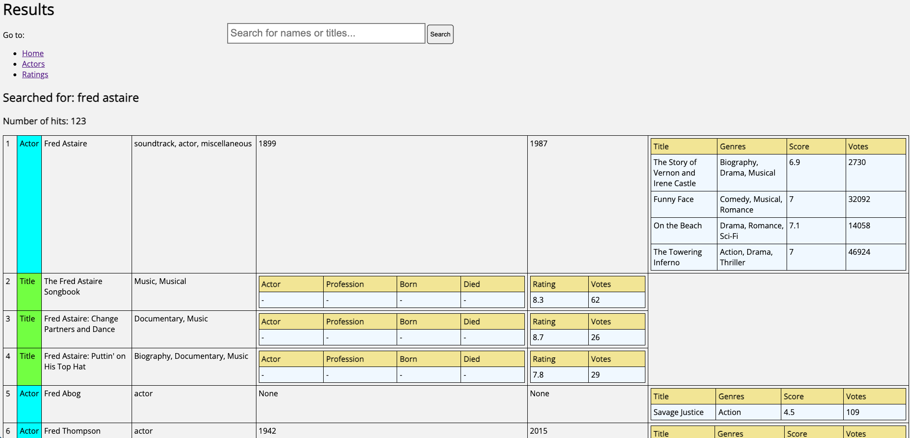

# IMDb datasets with Optimizely Graph

This sample shows how you can use synchronize datasets from IMDb to Optimizely Graph and consume it from there. It shows a simple headless solution using Python where the backend is Optimizely Graph.

## Documentation
- [Understanding your data](https://docs.developers.optimizely.com/digital-experience-platform/v1.4.0-content-graph/docs/understanding-your-data)
- [Defining the content types](https://docs.developers.optimizely.com/digital-experience-platform/v1.4.0-content-graph/docs/defining-the-content-types)
- [Synchronize your data](https://docs.developers.optimizely.com/digital-experience-platform/v1.4.0-content-graph/docs/synchronize-your-data)
- [Consume data with queries](https://docs.developers.optimizely.com/digital-experience-platform/v1.4.0-content-graph/docs/consume-data-with-queries)

## Prerequisites
- Python 3
- Pip
- Optimizely Graph account

## Getting started
- Install required packages with `pip install -r requirements.txt`
- Index the data by running this command:
  - `AUTH_TOKEN=<AUTH_TOKEN> HOST=https://cg.optimizely.com python3 index_data.py`
  - Use the environment variables `AUTH_TOKEN` and `HOST` to configure, where `AUTH_TOKEN` is the basic authentication token excluding the `basic` keyword.
  - The script will terminate when it finished and in the console the following logs will be printed:
  - ```
    DEBUG:urllib3.connectionpool:https://cg.optimizely.com:443 "POST /api/content/v2/data?id=imdb HTTP/1.1" 200 None
    INFO:root:{"journalId":"stream/3568504a-c78f-4ab7-b32e-81554786befe"}
    DEBUG:urllib3.connectionpool:Starting new HTTPS connection (1): cg.optimizely.com:443
    DEBUG:urllib3.connectionpool:https://cg.optimizely.com:443 "POST /api/content/v2/data?id=imdb HTTP/1.1" 200 None
    INFO:root:{"journalId":"stream/59f6858c-0bce-4d96-aac3-b46daa49981d"}
    ```
- Run the sample web application and try out the pre-configured Optimizely Graph queries in GraphQL:
  - Run `python3 app.py`
  - Open browser en go to http://localhost:7001/
  - When you enter `fred astaire`, you should see this:
    

## Contributions
- Contributions are welcome! Feel free to create a PR.
